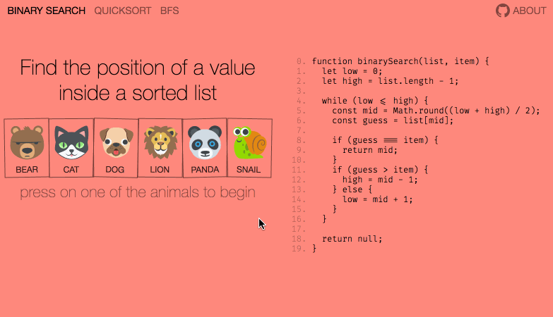

# Illustrated Algorithms
Algorithm → AST → CSS (3 x JavaScript)

[](https://illustrated-algorithms-ommzftrylh.now.sh/)

Inspired by [Grokking Algorithms](https://www.manning.com/books/grokking-algorithms) and [python-execution-trace](https://github.com/mihneadb/python-execution-trace), this project aims to make common algorithms easier to grasp through interactive visualizations of their execution.

Visual representations of local variables augment the control flow, alongside actual source code. You can fast forward and rewind the execution to closely observe how an algorithm works.

## Principles

- The same code that is displayed next to the illustration is also decorated using [Babel](babel-plugin-trace-execution/src/index.js) and executed to record the context at every step. Literally the same source file.
- Going back and forth between function execution (and call stack when algorithm uses recursion) is effortless. So is pausing and resuming.
- Visualizations are easy to follow, fun to play with and simple enough to fit inside the screen of any modern phone.

## Work in progress

- Follow [@skidding](https://twitter.com/skidding) for updates
- Check out gifs attached to [Releases](https://github.com/skidding/illustrated-algorithms/releases) to see project evolution
- See [How to contribute](#how-to-contribute) below

## Dynamic styles

This project uses [styled-jsx](https://github.com/zeit/styled-jsx), but takes the idea of *CSS-in-JS* even further. Sizing, positioning and transition offsets are computed by JS, all before elements hit the DOM. This provides complete control over layout (e.g. font scaling relative to container width, rounded to a multiplier of 2) and animation (e.g. pausing in the middle of a transition and rewinding). It's a wild concept that hopefully gets mainstream someday.

## How to contribute

Consider the following actions if you want to advance this project:

- Find and/or fix bugs
- Add tests for the [Babel plugin](babel-plugin-trace-execution/src/index.js)
- Improve rendering perf (already decent, but not ideal due to [how styles are applied](#dynamic-styles))
- Propose algorithms to add (that can fit in a func <=25 lines of ES6)
- Create elegant illustrations (sketches/wireframes do) – **Hello graphic designers and people who draw!**

## Development

```bash
npm i
# One time (and after you modify Babel plugin)
npm run build:babel
# Start Next.js server (localhost:3000)
npm run dev
```
